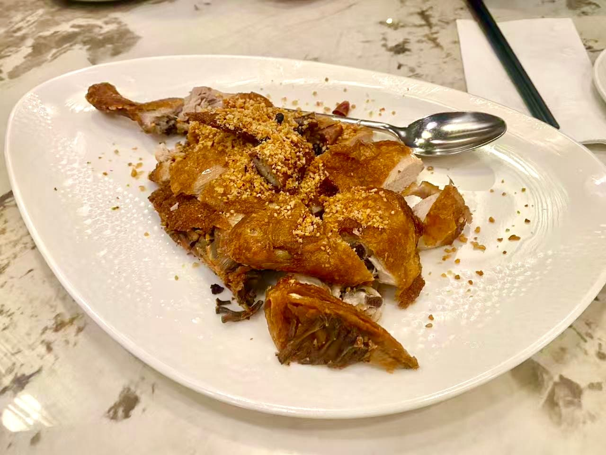
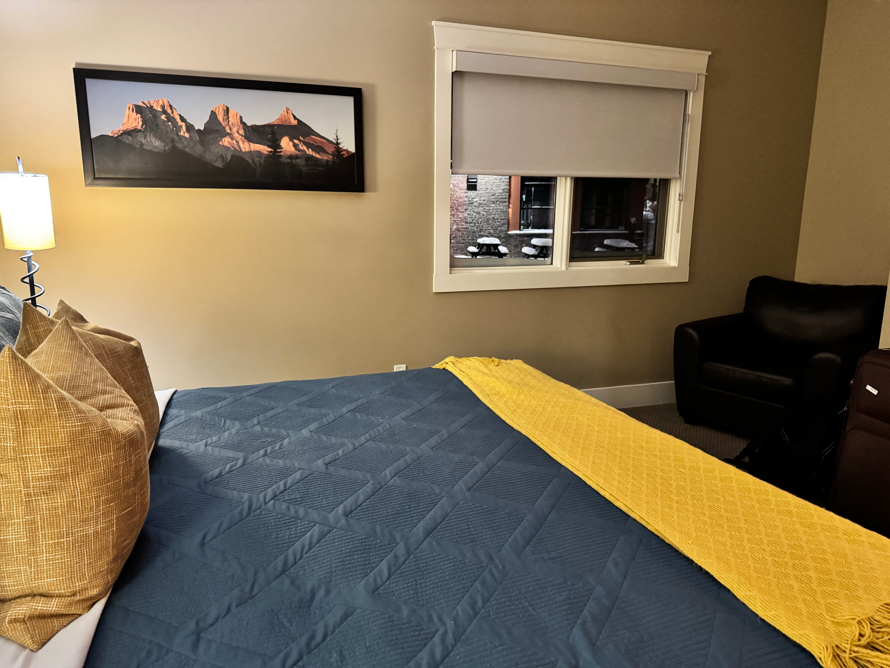
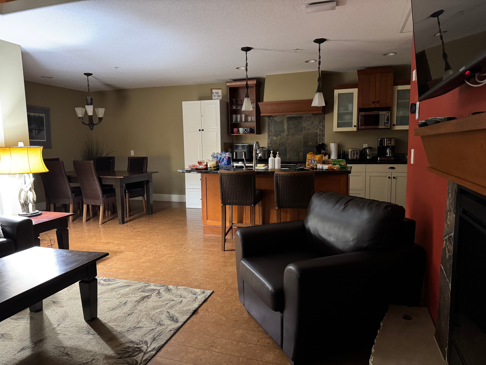
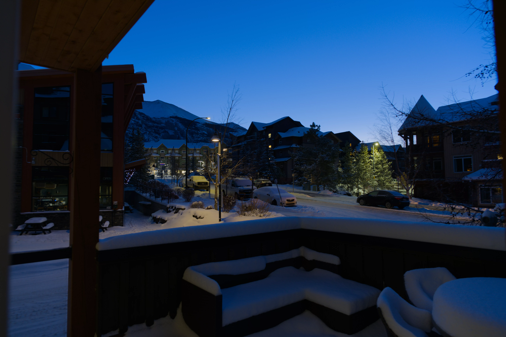
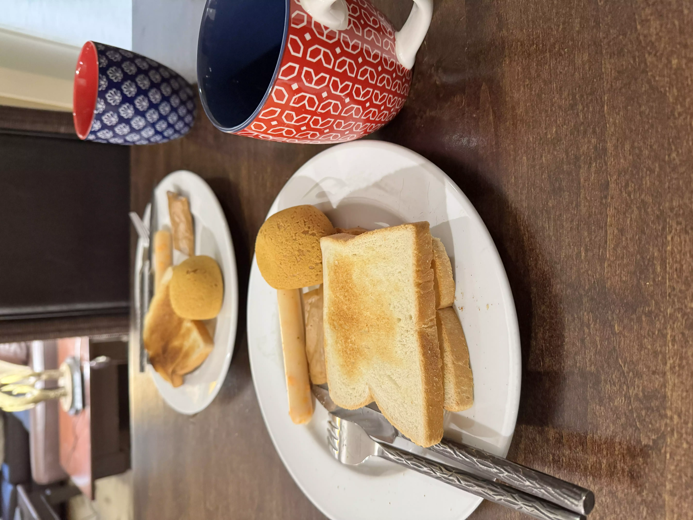
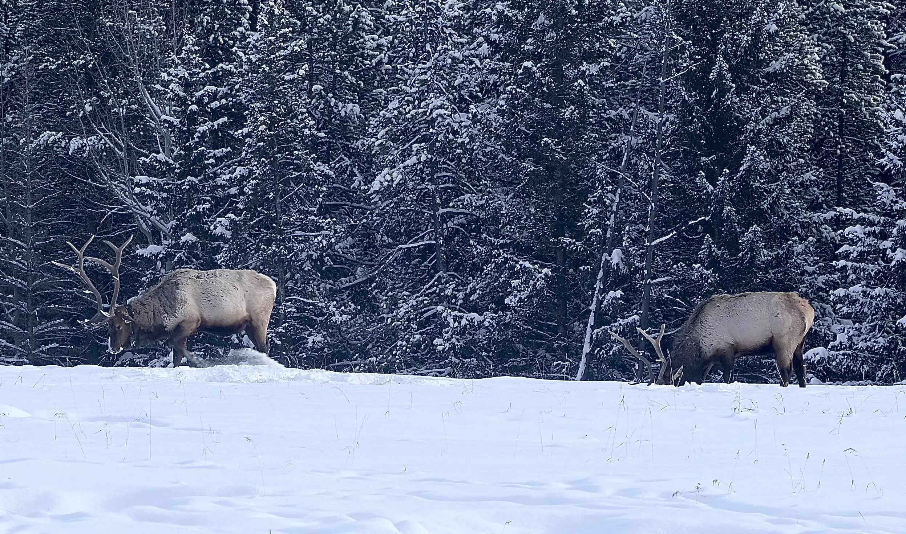
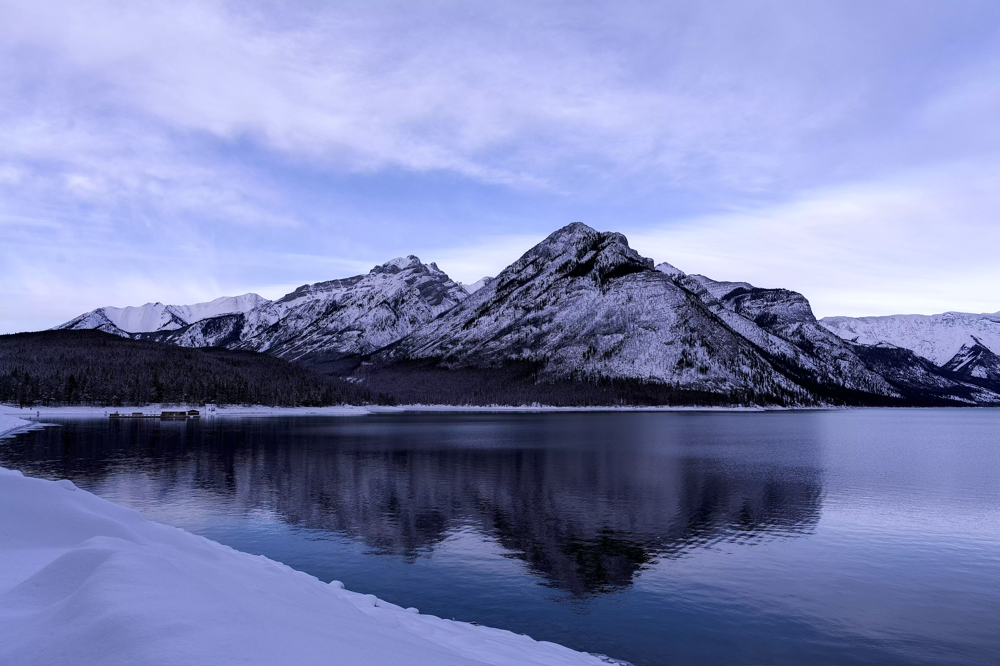
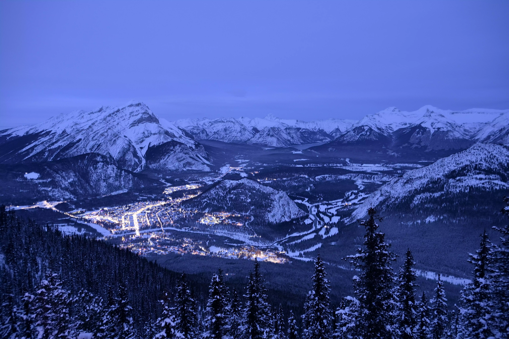

# **【12月24日·出发】**

早晨七点。
在这个本该属于睡眠的时间，我像个神经病一样睁大了眼睛。洗漱，吞咽早饭，一切如常，机械得像个被设定好程序的炼金人偶。我又检查了两遍行李，它们静静地躺在角落，像是随时准备奔赴战场的铠甲。
我瘫在椅子上看着天花板发呆。明明只是一场普通的旅行，可我的嘴角就像被胶带扯着一样，怎么都放不下来。

十点，集结号吹响。目的地：Anderson家。
推开门的一瞬间我愣住了——Sophie居然已经到了。这个像冬天一样的女孩明明最爱睡觉。既然人齐了，那就出发吧，向着人生的下一个路口。

虽说是平安夜，机场却空旷得像世界末日后的避难所。没有圣诞老人的铃声，只有冰冷的广播回荡。
Check in，过安检，流程枯燥得让人想睡觉。坐在登机口，为了消磨这漫长的等待，我和Anderson并肩杀进了《元气骑士》的像素地牢，Rita则是在画画。
一点半的飞机，意味着现在必须进食。为了生存，我不得不买两个鸡肉卷。咬下去的第一口我就后悔了，难吃得像是把硬纸板塞进了嘴里。但这毕竟是能量，如果不吃，下午大概会饿死在万米高空吧。

终于登机。
引擎轰鸣声中，周围的人睡得像一群死猪，只有我点亮了屏幕——《电锯人》，启动。
玛奇玛小姐在屏幕里微笑，我在屏幕外吃着泡面。是的，飞了一个小时我又饿了。Sophie递过来手机，那是她小时候的照片，像个精致的洋娃娃。我看了看，心想幸好没拿出我小时候的照片，那大概像个刚从泥坑里爬出来的猴子，太搞笑了。

落地，舱门打开，寒意如刀割面。
世界一片惨白，看着就冷。取完行李冲出机场，外面正飘着细碎的雪花。那一刻我承认，虽然冷，但真美啊，美得让人想在雪地里打个滚。
“我靠，时间来不及了！”
现实总是打断抒情。租车行快关门了，我们像是在跟时间赛跑的亡命-徒，一路狂飙。
五点三十，我们在卷帘门落下前的最后一刻赶到了。本来预定的是一辆奔驰，那是属于成功人士的座驾。可惜，因为年龄不够——或者说因为我们还是一群没长大的孩子——只能钻进一辆朴实的丰田里。
好吧，丰田也不错，至少耐造，像是我们这些平凡人的命。

拿到车，饥饿感像潮水一样涌上来。目标锁定：山河聚。
推开餐厅大门，热气扑面而来。装修居然还挺酷，平安夜里人声鼎沸，看起来是个不错的地方。点菜的时候我的胃已经开始消化我的肋骨了。
“我要鱼香肉丝！”这是我对中餐最后的执念。
Sophie点了炸子鸡和炒大虾，还有红糖糍粑。等待的半个小时像是一个世纪那么漫长。
终于，炸子鸡端上来了。那一刻，香气炸裂，我恨不得把舌头都吞下去。米饭！快上米饭！鱼香
  
肉丝紧随其后，纯正的味道在味蕾上跳舞，喜欢！
最后的炒大虾辣得让人头皮发麻，像是吞了一团火，只好打包带走。

填饱肚子，转战大统华。扫荡完零食和物资，我们终于驶向那个未知的小镇。
夜幕降临，虽然看不清，但依稀能看到大山像巨人的剪影耸立在黑暗中。我想象着明天清晨，阳光刺破云层照在雪山顶上，那该是怎样的日照金山。

到了。
哇哦。
那个小镇在黑夜里灯火通明，亮得像是指环王里的瑞文戴尔。那些房子看着真酷，等等，我们真的要住在这里吗？这也太棒了吧，棒得让我觉得自己像个混进贵族晚宴的窃贼。

这房子居然有地下车库，旁边还有Spa和泳池。
输入密码，大门开启，像是打开了潘多拉的魔盒。
主卧是Queen size的大床，古典家具散发着木头的香气，独立卫浴一应俱全。客卧的灯光暖黄，温馨得让人想立刻倒头就睡。最绝的是客厅，巨大的落地窗外就是漫天雪景，美得不真实。
这客厅大得足够容纳我们四个人开黑。哪怕让我在这里住一个月，死在这里都行。

这一天折腾下来，骨头都快散架了。
放下行李，洗去一身风尘。所有人洗漱完毕，属于男人们的保留节目开始了——PUBG！
Rita那个叛徒跑去玩了三角洲，呵，洲批，Sophie的睡衣完全就是小学生嘛。

不知过了多久，眼皮重得像挂了铅球。我和Rita实在扛不住了。
倒在床上的时候，我满脑子都是明天的太阳。
晚安，世界。好期待明天。

# **【12月25日·极乐净土与泡面】**

“热……好热。” 谁能想到，在北纬51度的雪山脚下，在这样一个应该被冻成冰雕的早晨，我竟然是被热醒的。这暖气开得简直像是要把我们烤熟了献祭给太阳神。

窗外的阳光刺破窗帘的缝隙，暴力地投射在我的眼皮上。我眯着眼拉开窗帘，那一瞬间，视网膜差点过载。 我忍不住笑出声来。这才是圣诞节该有的样子啊，而不是缩在被窝里瑟瑟发抖。 外面的天空蓝得像是新海诚电影里的每一帧截图，饱和度拉满。远处的雪山在阳光下闪闪发光，像是一群穿着银甲的巨人静静伫立；近处的松树披着厚厚的白雪，空气里除了寒冷，还有一种清冽的雪香，吸一口感觉肺都被净化了。

洗漱完毕，该是展现技术的时候了。 早餐时间。幸好昨天在大统华扫荡了物资。烤面包、小零食，人手一杯饮料。最搞的是那个咖啡机，我满怀期待地操作了一通，结果出来的东西甜得像是初恋……好吧，其实就是那是糖水吧喂！

吃完早饭，接下来是漫长的等待。 Sophie正在进行一项名为“化妆”的精密工程。我说我可以帮忙，毕竟我自诩拥有神之手，结果遭到了她们无情的嘲笑和拒绝。 真是伤心，凡人果然不懂艺术。

两个小时后。 是的，你没看错，整整两个小时。这段时间足够我们教授讲完一本书了。 终于，我们吃上了午饭。 在这个风景如画的豪宅里，在这个神圣的圣诞节，我们的午餐是—— 一人一大碗泡面！ 哈哈哈哈，没有什么比在异国他乡吸溜一碗热气腾腾的泡面更让人感到灵魂升华的了。碳水化合物万岁！

出发！目标锁定：各大景点！ 车轮碾过积雪，阳光洒在车窗上，把车厢烤得暖洋洋的。我们就这样一路向着湖边飞驰，窗外的雪山、松树和湖泊像是一幅幅画卷在眼前展开，美得不真实。

第一站：明尼万卡湖（Lake Minnewanka）。 名字听起来有点像什么古老的咒语。路边偶遇了一位放牛的大叔，白茫茫的雪原上，那几只黑色的牛显得格外扎眼。黑与白，静与动，整个冬天仿佛因为它们而活了过来。 开着开着，前面的车突然都停了。 难道是有什么隐藏任务触发了？我们赶紧靠边停车。 我靠！是麋鹿！野生的！ 那家伙真的超级大，站在雪地里像是一尊威严的雕塑。这种只有在游戏里才能见到的Boss级生物出现在眼前时，那种压迫感和惊喜感简直无法形容。

告别了麋鹿先生，我们抵达了湖边。 湖面竟然还没有完全结冰，水清得像是一块巨大的翡翠，倒映着蓝天白云和远处的雪山。 有人在钓鱼，有人在散步。世界安静得只能听到风的声音。我们在湖边疯狂按快门，试图把这一刻的时间定格。

下一站：硫磺山（Sulphur Mountain）。 听名字感觉会有恶龙居住，但其实是班夫的制高点。 坐上缆车，大地在我们脚下缓缓下沉。当缆车冲出云端，站在山顶俯瞰整个班夫小镇时，那种“会当凌绝顶”的感觉油然而生。群山如海，我们如尘埃，但这一刻，尘埃也在闪闪发光。

下山后，最神经病但也最开心的一幕发生了。 我们在空旷的停车场里，像群傻瓜一样大声唱起了《Jingle Bells》。 “Jingle bells, jingle bells, jingle all the way!” 笑声在空旷的山谷里回荡。管他有没有人听见，这一刻快乐是属于我们的。

既然到了班夫，怎能不去镇上晃晃。 班夫镇充满活力，到处都是有趣的商店。本来想去吃拉面，结果门口的队伍长得让人绝望。 没办法，退而求其次选了一家韩式烤肉。 Emmm……怎么说呢，味道一般般。感觉像是被狠狠地收了一波“游客税”。

夜幕降临，气温骤降。 本来还计划去看灯光秀，但实在太冷了，冷得感觉耳朵都要掉下来了。 撤退！回家！ 回到那个温暖的“基地”，给爸妈发发照片，吹吹牛，然后打开电脑，钻进游戏的世界。 外面是冰天雪地，屋里是热火朝天。 美好的一天结束了，虽然平淡，但足够闪亮。 晚安，期待明天的冒险！